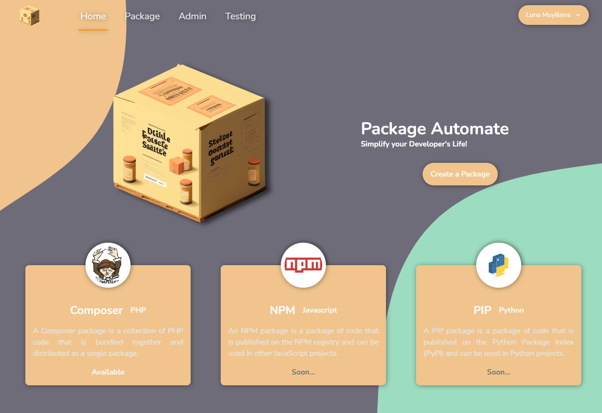
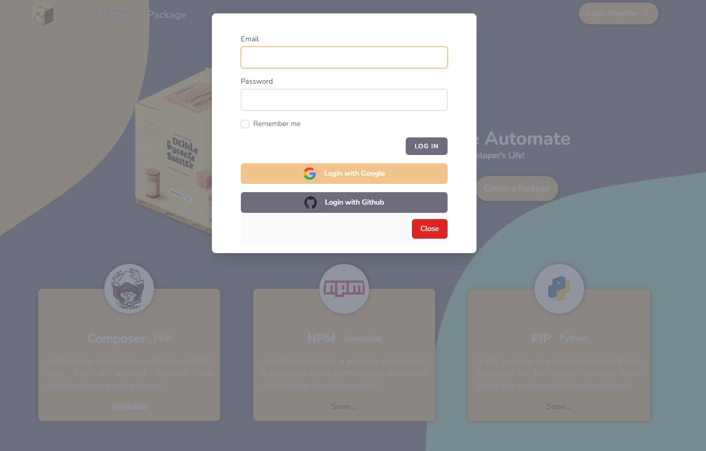
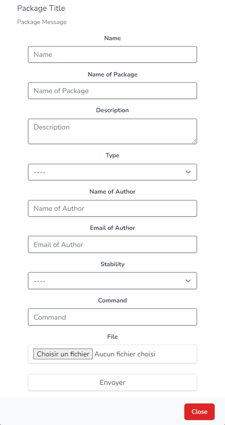
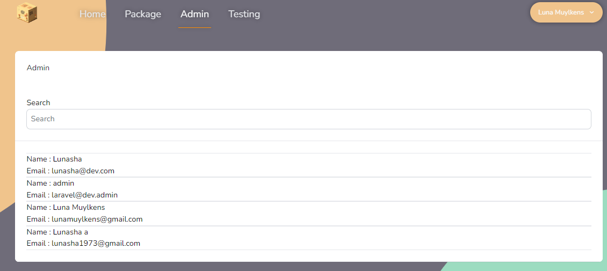

# Package Automate

## What's the project ?

This package provides a simple way to automate tasks in your creation of a PHP, NPM, Python Package.

You give your script and the package will create the package for you.

## Features

-   [x] Create a new PHP Package
-   [x] Login to your Github account
-   [x] Login to your Google account
-   [x] Automate of FORMS in React
-   [x] Artisan Command to see the last files created

## Technologies

-   [x] PHP
-   [x] React
-   [x] Laravel
-   [x] Tailwind
-   [x] Docker
-   [x] Inertia
-   [x] Javascript

## Form Generator with React & Inertia

### Create a new Form

```js
export const VendorParameters = {
    Name: {
        HTMLTag: "input",
        inputType: "text",
        inputName: "name",
        inputLabel: "Name",
        inputPlaceholder: "Name",
        inputRequired: true,
        inputDisabled: false,
        inputReadOnly: false,
    },
    NamePackage: {
        HTMLTag: "input",
        inputType: "text",
        inputName: "namePackage",
        inputLabel: "Name of Package",
        inputPlaceholder: "Name of Package",
        inputRequired: true,
        inputDisabled: false,
        inputReadOnly: false,
    },
    Description: {
        HTMLTag: "textarea",
        inputName: "description",
        inputLabel: "Description",
        inputPlaceholder: "Description",
        inputRequired: true,
        inputDisabled: false,
        inputReadOnly: false,
    },
    Type: {
        HTMLTag: "select",
        inputName: "type",
        inputLabel: "Type",
        inputRequired: true,
        InParameter: {
            Library: {
                optionValue: "Library",
                optionLabel: "Library",
            },
            Project: {
                optionValue: "Project",
                optionLabel: "Project",
            },
            Metapackage: {
                optionValue: "Metapackage",
                optionLabel: "Metapackage",
            },
            ComposerPlugin: {
                optionValue: "ComposerPlugin",
                optionLabel: "ComposerPlugin",
            },
        },
    },
    NameAuthor: {
        HTMLTag: "input",
        inputType: "text",
        inputName: "nameAuthor",
        inputLabel: "Name of Author",
        inputPlaceholder: "Name of Author",
        inputRequired: true,
        inputDisabled: false,
        inputReadOnly: false,
    },
    EmailAuthor: {
        HTMLTag: "input",
        inputType: "email",
        inputName: "emailAuthor",
        inputLabel: "Email of Author",
        inputPlaceholder: "Email of Author",
        inputRequired: true,
        inputDisabled: false,
        inputReadOnly: false,
    },
    Stability: {
        HTMLTag: "select",
        inputName: "stability",
        inputLabel: "Stability",
        inputRequired: true,
        InParameter: {
            Stable: {
                optionValue: "Stable",
                optionLabel: "Stable",
            },
            RC: {
                optionValue: "RC",
                optionLabel: "RC",
            },
            Beta: {
                optionValue: "Beta",
                optionLabel: "Beta",
            },
            Alpha: {
                optionValue: "Alpha",
                optionLabel: "Alpha",
            },
            Dev: {
                optionValue: "Dev",
                optionLabel: "Dev",
            },
        },
    },
    Command: {
        HTMLTag: "input",
        inputType: "text",
        inputName: "command",
        inputLabel: "Command",
        inputPlaceholder: "Command",
        inputRequired: true,
        inputDisabled: false,
        inputReadOnly: false,
    },
    File: {
        HTMLTag: "input",
        inputType: "file",
        inputName: "file",
        inputLabel: "File",
        inputPlaceholder: "File",
        accept: ".php",
    },
    Submit: {
        HTMLTag: "input",
        inputType: "submit",
        inputName: "Submit",
        inputDisabled: false,
    },
};
```

### Form Automate & import FormParameters

```js
import React, { useEffect, useState } from "react";
import { Inertia } from "@inertiajs/inertia";
import { VendorParameters } from "@/Components/Custom/FormParameters/VendorParameter";
import { NodeParameters } from "@/Components/Custom/FormParameters/NodeParameters";

export default function Form(props) {
    const [data, setData] = useState({});

    useEffect(() => {
        switch (props.name) {
            case "Vendor":
                setData(VendorParameters);
                break;
            case "Node":
                setData(NodeParameters);
                break;
            default:
                break;
        }
    }, [props.name]);

    const [request, setRequest] = useState(
        Object.keys(data)
            .slice(0, -1)
            .reduce((obj, key) => {
                obj[key] = "";
                return obj;
            }, {})
    );

    const handleChange = (e) => {
        setRequest({
            ...request,
            [e.target.name]: e.target.value,
        });
    };

    const handleSubmit = (e) => {
        e.preventDefault();
        Inertia.post(props.action, request, {
            forceFormData: true,
        });
    };

    return (
        <form
            encType={"multipart/form-data"}
            className="flex flex-col items-center justify-center"
            onSubmit={handleSubmit}
        >
            {data &&
                Object.keys(data).map((key, index) => {
                    if (data[key].HTMLTag === "input") {
                        return (
                            <div
                                className="mb-4 w-full flex flex-col items-center justify-center"
                                key={index}
                            >
                                <label
                                    className="block text-gray-700 text-sm font-bold mb-2"
                                    htmlFor={data[key].inputName}
                                >
                                    {data[key].inputLabel}
                                </label>
                                <input
                                    className={
                                        "w-9/12 shadow appearance-none border rounded py-2 px-3 text-gray-700 leading-tight focus:outline-none focus:shadow-outline"
                                    }
                                    id={data[key].inputName}
                                    name={data[key].inputName}
                                    type={data[key].inputType}
                                    placeholder={data[key].inputPlaceholder}
                                    required={data[key].inputRequired}
                                    disabled={data[key].inputDisabled}
                                    readOnly={data[key].inputReadOnly}
                                    autoComplete="off"
                                    onChange={handleChange}
                                    {...(data[key].inputType === "file"
                                        ? {
                                              onChange: (e) => {
                                                  setRequest({
                                                      ...request,
                                                      [e.target.name]:
                                                          e.target.files[0],
                                                  });
                                              },
                                          }
                                        : {
                                              value: request[
                                                  data[key].inputName
                                              ],
                                          })}
                                    {...(data[key].inputType === "file" &&
                                    data[key].accept
                                        ? {
                                              accept: data[key].accept,
                                          }
                                        : {})}
                                />
                            </div>
                        );
                    } else if (data[key].HTMLTag === "select") {
                        return (
                            <div
                                className="mb-4 w-full flex flex-col items-center justify-center"
                                key={index}
                            >
                                <label
                                    className="block text-gray-700 text-sm font-bold mb-2"
                                    htmlFor={data[key].inputName}
                                >
                                    {data[key].inputLabel}
                                </label>
                                <select
                                    className="w-9/12 shadow appearance-none border rounded py-2 px-3 text-gray-700 leading-tight focus:outline-none focus:shadow-outline"
                                    name={data[key].inputName}
                                    onChange={handleChange}
                                    required={data[key].inputRequired}
                                >
                                    <option value="" disabled selected>
                                        ----
                                    </option>
                                    {Object.keys(data[key].InParameter).map(
                                        (id, indexOption) => {
                                            return (
                                                <option
                                                    value={
                                                        data[key].InParameter[
                                                            id
                                                        ].optionValue
                                                    }
                                                    key={indexOption}
                                                >
                                                    {
                                                        data[key].InParameter[
                                                            id
                                                        ].optionLabel
                                                    }
                                                </option>
                                            );
                                        }
                                    )}
                                </select>
                            </div>
                        );
                    } else if (data[key].HTMLTag === "textarea") {
                        return (
                            <div
                                className="mb-4 w-full flex flex-col items-center justify-center"
                                key={index}
                            >
                                <label
                                    className="block text-gray-700 text-sm font-bold mb-2"
                                    htmlFor={data[key].inputName}
                                >
                                    {data[key].inputLabel}
                                </label>
                                <textarea
                                    className="w-9/12 shadow appearance-none border rounded py-2 px-3 text-gray-700 leading-tight focus:outline-none focus:shadow-outline"
                                    id={data[key].inputName}
                                    name={data[key].inputName}
                                    placeholder={data[key].inputPlaceholder}
                                    required={data[key].inputRequired}
                                    disabled={data[key].inputDisabled}
                                    readOnly={data[key].inputReadOnly}
                                    autoFocus={data[key].inputAutoFocus}
                                    autoComplete="off"
                                    onChange={handleChange}
                                />
                            </div>
                        );
                    }
                })}
        </form>
    );
}
```

## Design & UI

### Home Page



### Login



### Form



### Admin Account


